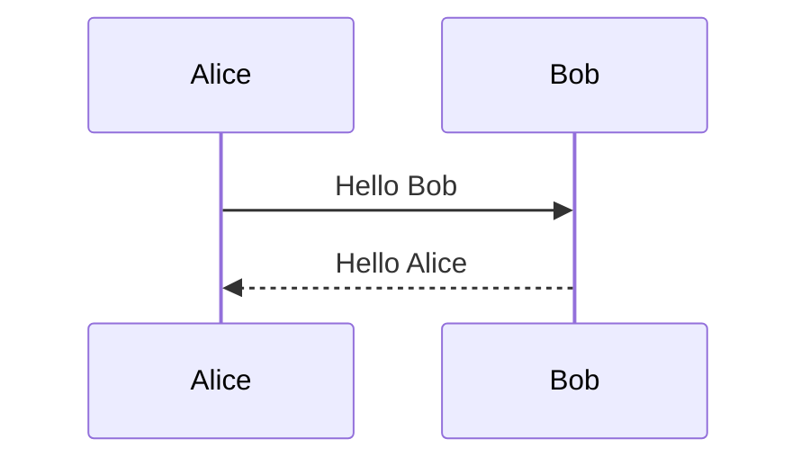
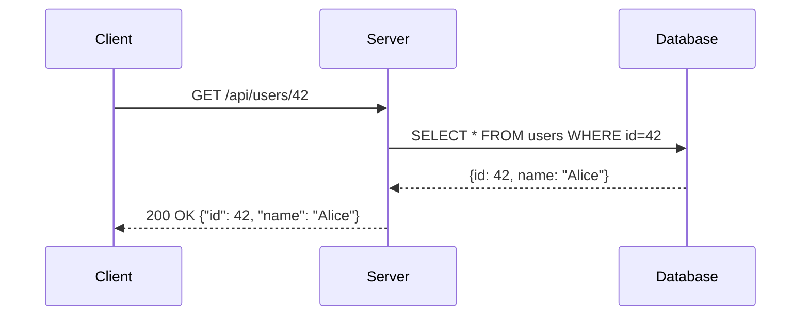
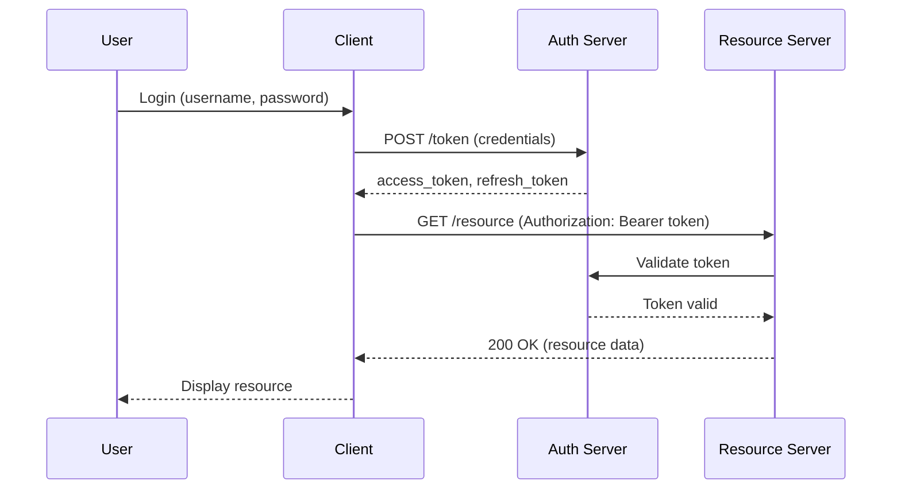
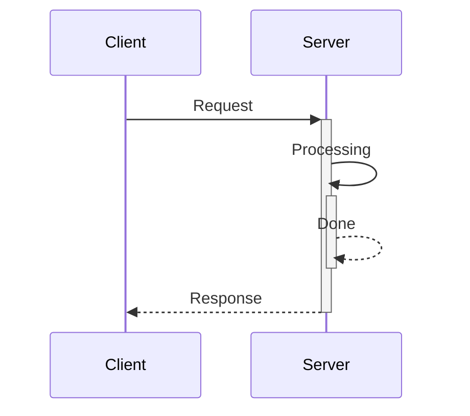
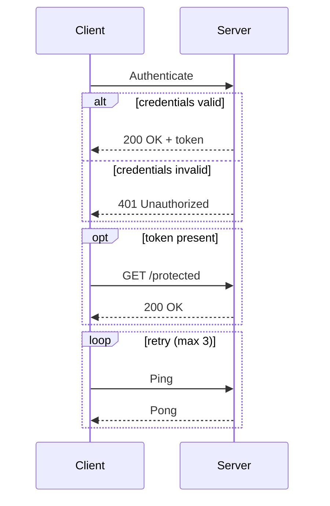
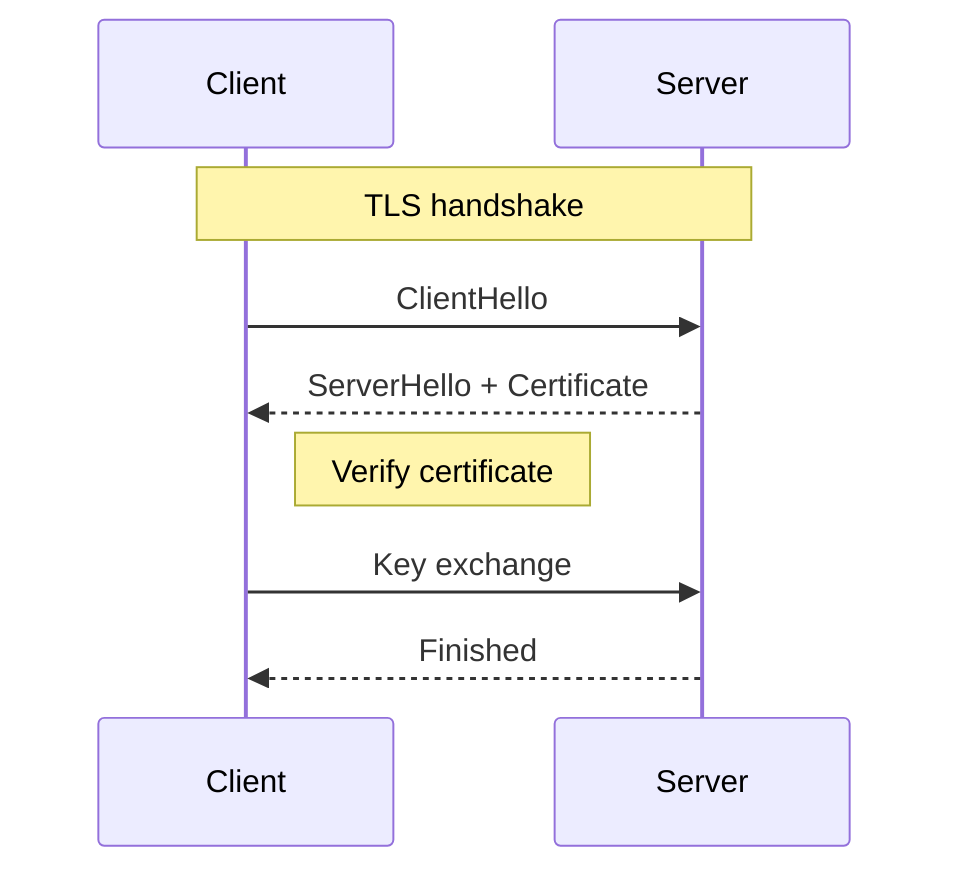

# Mermaid

Mermaid is a JavaScript-based diagramming tool that renders Markdown-inspired text definitions into diagrams.

## Sequence Diagram

A sequence diagram shows interactions between participants over time.

### Basic Syntax

Arrow types:

| Arrow  | Description                |
|--------|----------------------------|
| `->`   | Solid line, no arrowhead   |
| `-->` | Dashed line, no arrowhead  |
| `->>`  | Solid line, arrowhead      |
| `-->>` | Dashed line, arrowhead     |
| `-x`   | Solid line, cross at end   |
| `--x`  | Dashed line, cross at end  |

### Example: HTTP Request/Response

### Example: Authentication Flow

### Activation Boxes

Use `+` / `-` to show when a participant is active.

### Alt / Opt / Loop

### Notes

