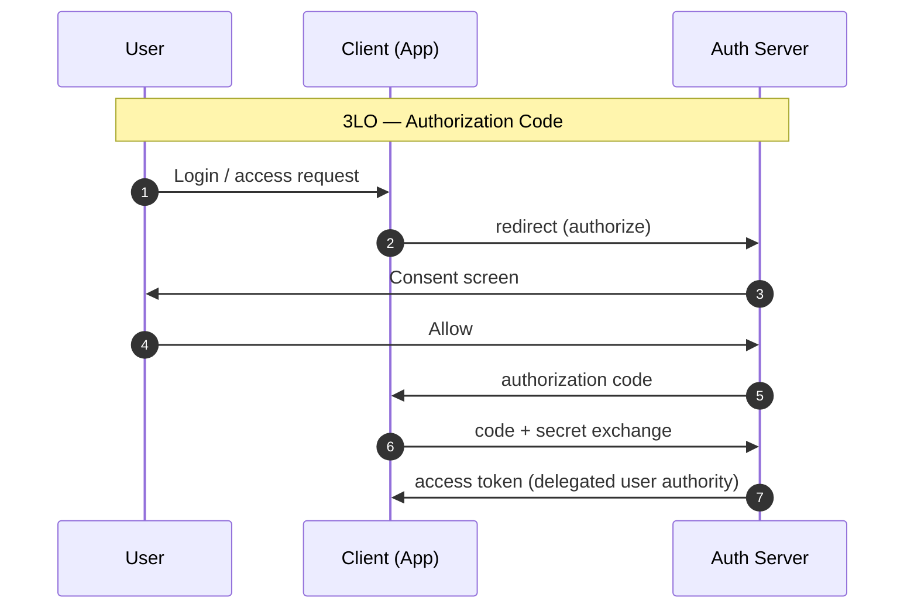
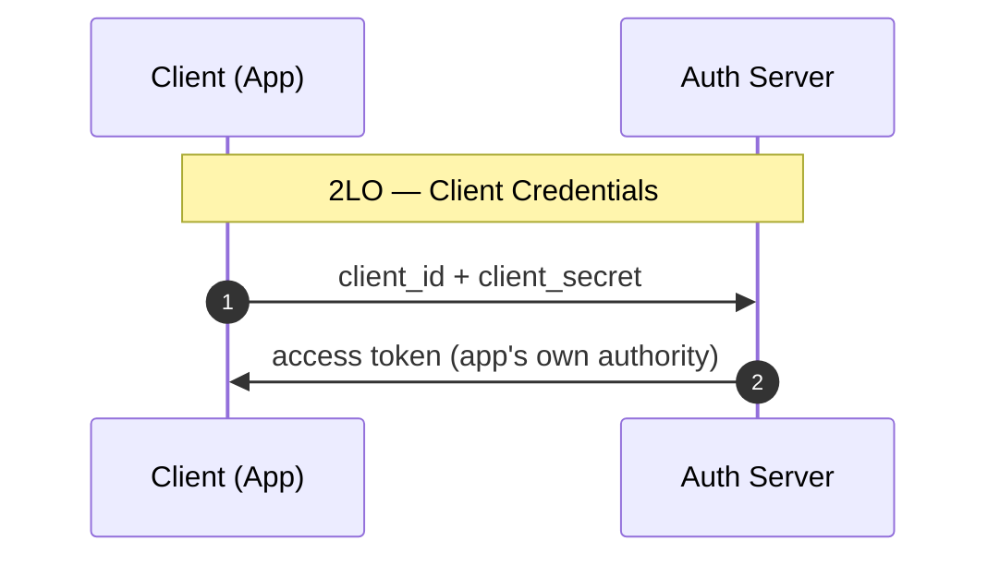

# OAuth
## What is OAuth?

OAuth (Open Authorization) is an open standard protocol for **delegated authorization (위임 인가)**.
- Allows a client application to access resources on behalf of a user **without exposing the user's credentials**.
- The user grants limited access (scope) to the client; the client receives a token representing that grant.
- OAuth 2.0 (RFC 6749) is the current standard; OAuth 1.0 is deprecated.

**Key roles**
| Role | Description |
|------|-------------|
| Resource Owner | The user who owns the data and grants access |
| Client | The application requesting access on behalf of the user |
| Authorization Server | Issues tokens after authenticating the user and obtaining consent |
| Resource Server | Hosts the protected resources; validates tokens on each request |

**Core concepts**
- **Access Token**: Short-lived credential used to call the Resource Server API.
- **Refresh Token**: Long-lived credential used to obtain new access tokens without re-authentication.
- **Scope (범위)**: Defines the specific permissions the client is requesting (e.g., `read:email`, `write:calendar`).
- **Grant Type**: The flow used to obtain a token (Authorization Code, Client Credentials, Device Code, etc.).

OAuth is an **authorization (인가)** protocol, not an **authentication (인증)** protocol. For authentication, OpenID Connect (OIDC) is built on top of OAuth 2.0.

## 2LO & 3LO (2, 3-legged OAuth)

| Term | Parties | Consent Screen | Representative Grant | Use Case |
|------|---------|----------------|---------------------|----------|
| **3LO** (Three-Legged OAuth) | User + Client + Server | Present | Authorization Code | User-delegated access ("Allow this app to read my calendar") |
| **2LO** (Two-Legged OAuth) | Client + Server | Absent | Client Credentials | Server-to-server, batch jobs, infrastructure automation |

The number of "legs" refers to the **number of participating parties** in the OAuth flow. The core distinction is **whose authority the token represents**.

**3LO (Three-Legged OAuth)**
- Three parties: Resource Owner (User), Client (Application), Authorization Server + Resource Server.
- User explicitly grants permission via a consent screen; the token represents **delegated user authority**.
- Scope is bounded per user — if a token is compromised, blast radius is limited to that user's delegated permissions.
- Enables clear audit trails: every action is traceable to "on behalf of which user."
- Grant type: Authorization Code Flow (with PKCE for public clients).

**2LO (Two-Legged OAuth)**
- Two parties: Client and Authorization Server — no user involvement.
- The app authenticates with its own credentials; the token represents **the app's own authority**.
- No consent screen or user interaction required — suited for automated, machine-to-machine contexts.
- Grant type: Client Credentials Flow.

### 3LO Sequence diagram


```
User → Client : login / access request
Client → Auth Server : redirect (authorize)
Auth Server → User : consent screen
User → Auth Server : allow
Auth Server → Client : authorization code
Client → Auth Server : code + secret exchange
Auth Server → Client : access token (delegated user authority)
```

### 2LO Sequence diagram


```
Client → Auth Server : client_id + client_secret
Auth Server → Client : access token (app's own authority)
```

The difference is clear at a glance. In 3LO, the User enters the flow and directly clicks "allow"; in 2LO, the Client receives a token immediately with only credentials.

**When to use each**

| Scenario | Recommended |
|----------|-------------|
| Accessing resources on behalf of a specific user | 3LO |
| Multi-user SaaS reading user-owned data | 3LO |
| Server-to-server internal API calls | 2LO |
| Background batch / cron jobs | 2LO |
| Infrastructure automation with no user data | 2LO |