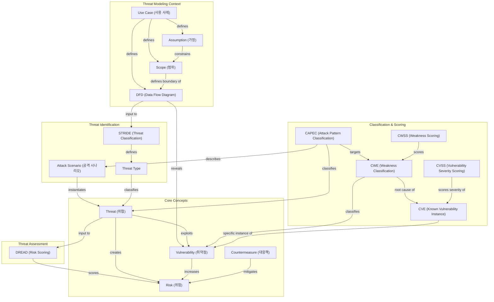

# Threat Modeling (위협 모델링)

a systematic process for identifying security threats, prioritizing them, and establishing appropriate countermeasures for a system.

## Before we start
- Confusing terms - Threat vs Vulnerability: A **vulnerability** (취약점) is a weakness that *exists* in a system (e.g. unpatched software, missing input validation). A **threat** (위협) is a potential action or event that *exploits* that weakness to cause harm (e.g. an attacker injecting SQL). In short — vulnerability is the flaw; threat is what acts on it. Risk arises when both are present.


## Contents
- Threat, Vulnerability, Risk (위협, 취약점, 위험)
- Process Overview
- Step 1: Scope Definition (범위 정의)
- Step 2: System Analysis
- Step 3: Threat Identification (위협 식별)
- Step 4: Threat Assessment & Prioritization (위협 평가 및 우선순위 지정)
- Step 5: Mitigation (대응책 도출)
- Step 6: Validation & Documentation (검증 및 문서화)
- Roles in assessing threats (위협 평가에서의 역할)
- Threat Modeling Tools example (위협 모델링 도구 예시)

---

## Threat, Vulnerability, Risk (위협, 취약점, 위험)

- **Threat (위협)**: A potential cause of an unwanted incident, such as an attacker, malware, insider misuse, or natural disaster.
- **Vulnerability (취약점)**: A weakness in design, implementation, configuration, or process that can be exploited by a threat.
- **Risk (위험)**: The possibility of loss or damage when a threat exploits a vulnerability, usually evaluated by likelihood and impact.


### Relationship
- A **threat** targets a **vulnerability**, which creates **risk**.
- Without a vulnerability, a threat may not lead to meaningful risk.
- Practical risk evaluation is often modeled as:

$$
Risk \approx Likelihood \times Impact
$$
- Likelihood depends on the presence of **vulnerabilities** and the capabilities of the **threat** actor.

## Threat modeling process comparison

| Approach | Primary Focus | Key Method | Best For |
|---|---|---|---|
| **NIST SP 800-30** | Risk assessment process | Risk identification → likelihood/impact analysis → risk response | Government, compliance-driven organizations |
| **MS Threat Modeling Tool** | DFD-driven threat identification + DREAD + risk assessment | Threat ID: STRIDE per Element applied to DFD components, auto-generates threats and mitigations; Risk scoring: DREAD — 5-factor scoring (Damage, Reproducibility, Exploitability, Affected Users, Discoverability) | Developer-driven, design-phase threat identification and prioritization |
| **OWASP Threat Dragon** | Visual, diagram-first threat modeling | Diagram-based; supports STRIDE, LINDDUN, CIA, DIE, PLOT4ai | Open-source teams, collaborative threat modeling sessions |
| **Shostack (Threat Modeling)** | Pragmatic, practitioner-oriented threat modeling | 4-Question Framework: *What are we building? What can go wrong? What should we do? Did we do a good job?* | Teams new to threat modeling, systematic coverage |


## Process Overview

```
1. Scope Definition (범위 정의)
      ↓
2. System Analysis — Asset Identification / Data Flow Mapping (자산 식별 / 데이터 흐름 파악)
      ↓
3. Threat Identification (위협 식별)
      ↓
4. Threat Assessment & Prioritization (위협 평가 및 우선순위 지정)
      ↓
5. Mitigation (대응책 도출)
      ↓
6. Validation & Documentation (검증 및 문서화)
```

---

## Step 1: Scope Definition (범위 정의)

- Clearly define the target system or feature to be modeled
- Define security objectives — Confidentiality, Integrity, Availability
- Establish Trust Boundaries (신뢰 경계)
- Define stakeholder (이해관계자) and attacker perspectives 

---

## Step 2: System Analysis

### Asset Identification (자산 식별)
- Enumerate data, services, and infrastructure to be protected 
- Examples: user personal data, authentication tokens, DB, API server

### Data Flow Diagram (DFD) Construction (DFD 작성)
- Visualize system components and data flows
- Key elements:
  - **Process**: Component that processes data (calculations, transformations)
  - **Data Store**: DB, files, cache, memory storage
  - **External Entity**: Users, external systems, third-party services
  - **Data Flow**: Data movement path between components (labeled with protocol/method)
  - **Trust Boundary**: Boundary where the security level changes — represents a line between trusted and untrusted zones (e.g., between user input and internal system, between application and external API, between user application and database). Any data crossing this boundary requires validation and security checks. 

> **Q.** Why do we define Trust Boundaries?  
> **A.** Defining trust boundaries helps identify points where security controls are needed to protect sensitive data and prevent unauthorized access.

> **Q.** Which element is considered as an asset in DFD?  
> **A.** An asset is anything whose compromise, loss, or disruption causes business, technical, or legal harm. All DFD elements can be assets — a Process (e.g., authentication logic), a Data Store (e.g., a database), an External Entity (e.g., a user account), and a Data Flow (e.g., a token in transit) are all candidates. Assets also extend beyond the DFD itself: source code, infrastructure, service availability, credentials, brand reputation, and regulatory compliance status all qualify. The DFD maps how assets flow and are handled; asset identification determines what is worth protecting in the first place.

---

## Step 3: Threat Identification (위협 식별)

### Threat Classification Methods
| Name | Description |
|------|------|
| **STRIDE** | Threat classification model covering **S**poofing, **T**ampering, **R**epudiation, **I**nformation Disclosure, **D**enial of Service, **E**levation of Privilege. |
| **LINDDUN** | Privacy threat modeling framework covering **L**inkability, **I**dentifiability, **N**on-repudiation, **D**etectability, **D**isclosure of information, **U**nawareness, **N**on-compliance. |
| **CIA** | Classic security triad — **C**onfidentiality, **I**ntegrity, **A**vailability. |
| **DIE** | **D**ata, **I**dentity, and **E**nvironment — a model for categorizing threats based on what they target. |
| **PLOT4ai** | AI-specific threat modeling framework covering **P**rivacy, **L**oss of Control, **O**perational, and **T**rust threats in AI systems. |

### STRIDE Model

| Threat Type  | Description | Violated Property |
|-----------|------|-----------|
| **S**poofing (스푸핑) | Impersonating another user or system (다른 사용자/시스템으로 위장) | Authentication (인증) |
| **T**ampering (변조) | Unauthorized modification of data or code (데이터 또는 코드 무단 수정) | Integrity (무결성) |
| **R**epudiation (부인) | Denying responsibility for an action (행위에 대한 책임 부정) | Non-repudiation (부인 방지) |
| **I**nformation Disclosure (정보 노출) | Unauthorized access to sensitive information (민감 정보 무단 접근) | Confidentiality (기밀성) |
| **D**enial of Service (서비스 거부) | Disrupting system availability (시스템 가용성 방해) | Availability (가용성) |
| **E**levation of Privilege (권한 상승) | Gaining unauthorized elevated permissions (허가되지 않은 높은 권한 획득) | Authorization (인가) |

#todo: LINDDUN, CIA, DIE, PLOT4ai models

---
<details>
<summary> More threat types (beyond STRIDE) </summary>

- **Physical Attack (물리적 공격)**: Unauthorized physical access to hardware — theft, device tampering
- **Supply Chain Attack (공급망 공격)**: Compromising software or hardware through a trusted third-party vendor
- **Social Engineering (사회공학)**: Manipulating people into revealing credentials or granting access — phishing, pretexting
- **Insider Threat (내부자 위협)**: Malicious or negligent actions by employees or contractors with legitimate access
- **Zero-Day Exploit (제로데이 익스플로잇)**: Attacking an unknown vulnerability before a patch exists
</details>


### Threat Identification Methods (위협 식별 방법)
- Apply STRIDE to each element in the DFD 
- Construct Attack Trees
- Reference past CVEs and attack patterns — CAPEC, ATT&CK 
- Brainstorming or expert review

> **Q.** Why use a classification framework like STRIDE?  
> **A.** Structured methods provide a systematic way to identify threats across different categories, **ensuring comprehensive coverage**.

> **Q.** Most common approach in practice?  
> **A.** Use a taxonomy such as STRIDE or LINDDUN for baseline threat identification.  
Attach evidence using CAPEC/CWE/CVE references.  
Quantify severity with CVSS.  
Map findings to controls and compliance requirements (for example, NIST and GDPR).

### Common Threats

- **Malware (악성코드)**: Malicious software such as viruses, worms, ransomware, and spyware that can disrupt operations, steal data, or encrypt systems for extortion.
- **Phishing and Social Engineering (피싱 및 사회공학)**: Deceptive messages or interactions that trick users into revealing credentials, sensitive data, or approving harmful actions.
- **Credential Attacks (자격증명 공격)**: Password spraying, brute force, and credential stuffing using leaked or weak passwords.
- **Insider Threat (내부자 위협)**: Intentional abuse or accidental misuse by employees, contractors, or partners with legitimate access.
- **Web Application Attacks (웹 애플리케이션 공격)**: Exploits such as SQL injection, XSS, and CSRF that target application logic and input handling.
- **Denial of Service (서비스 거부 공격, DoS/DDoS)**: Flooding services or exhausting resources to reduce availability.
- **Man-in-the-Middle (중간자 공격, MitM)**: Intercepting or altering communication between parties when transport security is weak or misconfigured.
- **Supply Chain Attack (공급망 공격)**: Compromise through third-party software, libraries, update channels, or service providers.
- **Misconfiguration and Unpatched Systems (오구성 및 미패치 시스템)**: Security gaps caused by insecure defaults, exposed services, or delayed vulnerability patching.


---

## Step 4: Threat Assessment & Prioritization (위협 평가 및 우선순위)

### Overview

| | **DREAD** | **Priority Matrix** |
|---|---|---|
| **Purpose** | Rank threats by estimated risk | Triage threats by likelihood × impact |
| **Output** | Numeric score 1–10 per threat | Quadrant label (High / Medium / Low) |
| **Input** | Subjective judgment across 5 criteria | Estimated likelihood and business impact |
| **Objectivity** | Low — assessor-dependent | Medium — depends on estimation quality |
| **Scope** | Threat-level (design/architecture) | Threat or risk-level |
| **Audience** | Internal dev/security team | Executives, rapid triage |
| **Standardization** | None (internal use) | None (organization-defined) |
| **Limitation** | Subjective; inconsistent across teams | No numeric precision; coarse granularity |
| **Best used when** | Early design phase, fast internal scoring | Executive briefing, quick prioritization |

### DREAD

| Item | Description|
|------|------|
| **D**amage | Magnitude of damage if attack succeeds (공격 성공 시 피해 규모) |
| **R**eproducibility | Likelihood the attack can be reproduced (공격 재현 가능성) |
| **E**xploitability | Ease of executing the attack (공격 실행의 용이성) |
| **A**ffected Users | Scope of users impacted (영향 받는 사용자 범위) |
| **D**iscoverability | Likelihood of discovering the vulnerability (취약점 발견 가능성) |

*each component scored 1~10

**Risk Score (위험도) = (D + R + E + A + D) / 5**     

### Priority Matrix (우선순위 매트릭스)

|  | Low Likelihood | High Likelihood  |
|---|:---:|:---:|
| **High Impact** | 🟡 Medium | 🔴 High — Act Immediately |
| **Low Impact** | 🟢 Low | 🟡 Medium |

> **Vulnerability assessment**: identifies and scores specific weaknesses (e.g., CVSS for a SQL injection vulnerability)  
> **Threat assessment**: evaluates potential attack scenarios and their likelihood and impact   
> **Risk assessment**: combines threat and vulnerability assessments to prioritize mitigation efforts

> **Q.** Criteria for choosing evaluation metrics?  
> **A.** Choose based on **purpose and context**:
> - **DREAD**: Best for internal, team-level threat modeling during early design phases. Quick to apply but subjective — scores depend on the assessor's judgment.
> - **Priority Matrix (Likelihood × Impact)**: Ideal for executive communication or rapid triage. Provides intuitive visual prioritization without numeric precision.
>
> In practice: use **DREAD or Priority Matrix** for fast internal prioritization, and **CVSS** when formal documentation or cross-organizational comparability is required.

---


## Step 5: Mitigation (대응책 도출)

Choose one of the following four response strategies for each threat:

| Strategy | Description | Example |
|------|------|------|
| **Mitigate <br> (완화)** | Reduce the likelihood or impact of the threat (위협 발생 가능성 또는 영향 감소) | Input validation, applying encryption (입력 검증, 암호화 적용) |
| **Accept <br> (수용)** | Accept the risk when it is low relative to cost (비용 대비 위험이 낮을 때 위험 감수) | Monitor-only for low-risk vulnerabilities (낮은 위험도 취약점 모니터링만 수행) |
| **Transfer <br> (전가)** | Transfer responsibility externally (책임을 외부로 이전) | Insurance, use of external services (보험 가입, 외부 서비스 이용) |
| **Eliminate <br> (제거)** | Remove the feature or asset causing the threat (위협 자체를 유발하는 기능/자산 제거) | Disable unnecessary features (불필요한 기능 비활성화) |

### Common Countermeasures per STRIDE (STRIDE별 일반적인 대응책)

| Threat | Key Countermeasures |
|------|------------|
| Spoofing | Strong authentication — MFA, digital signatures (강력한 인증, 디지털 서명) |
| Tampering | HMAC, digital signatures, access control (디지털 서명, 접근 제어) |
| Repudiation | Audit logs, timestamps (감사 로그, 타임스탬프) |
| Information Disclosure | Encryption (in-transit/at-rest), least privilege (암호화, 최소 권한 원칙) |
| Denial of Service | Rate limiting, redundancy, CDN (이중화) |
| Elevation of Privilege | Least privilege, RBAC, sandboxing (최소 권한 원칙, 샌드박스) |

---

## Step 6: Validation & Documentation (검증 및 문서화)

### Validation (검증)
- Confirm that derived countermeasures actually mitigate threats (도출한 대응책이 실제로 위협을 완화하는지 확인)
- Integrate with security testing — penetration testing, code review (보안 테스트, 코드 리뷰와 연계)
- Assess residual risk (잔여 위험 평가)

### Documentation Items (문서화)
- List of identified threats with STRIDE classification (식별된 위협 목록 및 STRIDE 분류)
- Risk score per threat (위협별 위험도 점수)
- Countermeasures and owners (대응책 및 담당자)
- Review schedule and history (검토 일정 및 이력)

---
## Roles in assessing threats (위협 평가에서의 역할)
 
- **Security Team**: Provides expertise on threat modeling methodologies, assists in identifying threats, and evaluates technical risk. (위협 모델링 방법론에 대한 전문 지식 제공, 위협 식별 지원, 기술적 위험 평가)
- **Development Team**: Offers insights into system design, implementation details, and feasibility of mitigations. (시스템 설계, 구현 세부 사항, 완화책의 실현 가능성에 대한 통찰력 제공)
- **Product Management**: Provides business context, helps prioritize threats based on user impact and strategic goals. (비즈니스 컨텍스트 제공, 사용자 영향 및 전략적 목표에 따른 위협 우선순위 지정 지원)
- **Compliance/Audit**: Ensures that identified threats and mitigations align with regulatory requirements and industry standards. (식별된 위협과 완화책이 규제 요구사항 및 업계 표준과 일치하는지 확인)
- **Executive Leadership**: Reviews high-level risk assessments and approves resource allocation for mitigation efforts. (고위험 평가 검토 및 완화 노력에 대한 자원 할당 승인)

---
## Vulnerability Classification and Scoring System

| Tool | Scope | Maintained by | Primary Use |
|------|-------|--------------|-------------|
| **CVE** | Specific known vulnerability instances | MITRE / NVD (NIST) | Reference and track disclosed vulnerabilities |
| **CWE** | Weakness types / root cause categories | MITRE | Classify and identify weakness patterns in design or code |
| **CWSS** | Scoring model for CWE weaknesses | MITRE | Prioritize weaknesses by technical impact and likelihood |
| **CAPEC** | Attack pattern catalog | MITRE | Identify and classify attacker techniques and attack patterns |
| **CVSS** | Vulnerability severity scoring system | FIRST | Quantify and communicate vulnerability severity with a standardized score |

### CVE (Common Vulnerabilities and Exposures)
- A publicly maintained dictionary of **known, disclosed vulnerabilities** (공개된 취약점 목록), each assigned a unique identifier (e.g., `CVE-2021-44228` for Log4Shell)
- Maintained by **MITRE**, enriched with CVSS scores and references by the **NVD (National Vulnerability Database)**
- CVE entries describe *what* is vulnerable (product, version) and *how* it can be exploited, but not the underlying root cause
- Used in threat modeling to **check whether a component in scope has known vulnerabilities** and to link findings to published exploit data

**CVE ID format**: `CVE-<year>-<sequence>` (e.g., `CVE-2024-3094`)

### CWE (Common Weakness Enumeration)
- A community-developed catalog of **software and hardware weakness types** (소프트웨어/하드웨어 취약점 유형 목록) — the *root causes* that lead to vulnerabilities
- Maintained by **MITRE**; organized as a hierarchical taxonomy (e.g., CWE-89: SQL Injection, CWE-79: XSS, CWE-200: Information Exposure)
- Unlike CVE (a specific instance), CWE describes a **category of weakness** applicable across many products and codebases
- Used in threat modeling to **label the weakness type behind a threat** and guide secure design decisions

| Level | Example | Meaning |
|-------|---------|---------|
| Class | CWE-20: Improper Input Validation | Broad weakness category |
| Base | CWE-89: SQL Injection | Specific weakness type |
| Variant | CWE-564: SQL Injection via Hibernate | Language/technology-specific instance |

> CWE entries are commonly referenced alongside CVE — a CVE describes **a specific vulnerable product instance**, while CWE identifies the underlying **weakness class that caused it**, which makes developers understand the **root cause** and apply appropriate mitigations.

### CWSS (Common Weakness Scoring System)
- A scoring framework for **quantitatively prioritizing CWE weaknesses** (CWE 취약점 유형 우선순위 정량화), complementing CWE classification with a numeric score
- Maintained by **MITRE**; scores range from **0 to 100**
- Evaluates weaknesses across three metric groups:

| Metric Group | Description |
|---|---|
| **Technical Impact** | Potential damage to confidentiality, integrity, availability if exploited |
| **Acquisition / Finding** | Ease of discovering the weakness (visibility, likelihood of automated detection) |
| **Exploitability** | Ease of exploiting the weakness (authentication required, interaction needed, prevalence) |

- Less widely adopted than CVSS — primarily used in CWE-centric analyses, secure coding initiatives, and software assurance programs
- Useful when prioritizing which weakness classes to address in a codebase or architecture, independent of specific CVE instances

### CAPEC (Common Attack Pattern Enumeration and Classification)
- A publicly maintained catalog of **known attack patterns** (공격 패턴 목록) — descriptions of how attackers exploit weaknesses in systems, software, and networks
- Maintained by **MITRE**; each entry (e.g., `CAPEC-66: SQL Injection`) describes the attack technique, prerequisites, execution steps, and applicable defenses
- Complements CWE: a CAPEC entry describes *how an attacker acts*, while CWE describes *the weakness being exploited*
- Used in threat modeling to **enumerate realistic attack scenarios** against identified system components and map them to STRIDE categories or ATT&CK techniques

**CAPEC ID format**: `CAPEC-<number>` (e.g., `CAPEC-116: Excavation`)

| Level | Example | Meaning |
|-------|---------|---------|
| Meta | CAPEC-225: Exploitation of Authentication | Broad attack category |
| Standard | CAPEC-66: SQL Injection | Specific attack technique |
| Detailed | CAPEC-110: SQL Injection through SOAP | Narrowly scoped attack variant |

> CAPEC, CWE, and CVE form a chain: **CAPEC** describes how an attacker targets a **CWE** weakness, which manifests as a specific **CVE** in a real product.

### CVSS (Common Vulnerability Scoring System)
- Industry-standard vulnerability severity scoring system
- Maintained by **FIRST (Forum of Incident Response and Security Teams)**; current versions are **v3.1** and **v4.0**
- Score range: **0.0 – 10.0** → mapped to severity levels

| Score | Severity |
|-------|----------|
| 0.0 | None |
| 0.1 – 3.9 | Low |
| 4.0 – 6.9 | Medium |
| 7.0 – 8.9 | High |
| 9.0 – 10.0 | Critical |

#### Score Components

**Base Score** — intrinsic characteristics of the vulnerability, independent of time or environment

| Metric Group | Metrics |
|---|---|
| Exploitability (공격 용이성) | Attack Vector (AV), Attack Complexity (AC), Privileges Required (PR), User Interaction (UI) |
| Scope (범위) | Scope (S) — whether the vulnerability impacts components beyond its authorization boundary |
| Impact (영향) | Confidentiality (C), Integrity (I), Availability (A) — each rated None / Low / High |

**Temporal Score** — adjusts Base Score based on current exploit and patch state

| Metric | Description |
|---|---|
| Exploit Code Maturity (E) | Whether a working exploit is publicly available (공개 익스플로잇 존재 여부) |
| Remediation Level (RL) | Whether an official patch or workaround exists (공식 패치 또는 완화책 여부) |
| Report Confidence (RC) | Confidence in the vulnerability report's accuracy (보고 신뢰도) |

**Environmental Score** — tailors the score to a specific deployment context

- Modifies Base metrics to reflect the actual environment (e.g., a confidentiality-focused system raises the Confidentiality impact weight)
- Defined by the organization consuming the score, not the vendor

#### Usage Notes
- CVSS measures **severity**, not **risk** — it does not account for **threat likelihood** or **business context**
- Use CVSS Base Score for vendor advisories and cross-organization comparison
- Use Environmental Score for internal prioritization aligned with your asset sensitivity
- Combine with threat intelligence (e.g., EPSS — Exploit Prediction Scoring System) for a more complete risk picture

| | Base Score | Temporal Score | Environmental Score |
|---|---|---|---|
| **What it measures** | Intrinsic severity of the vulnerability itself | Current real-world exploitability and patch state | Severity adjusted to your specific deployment context |
| **Changes over time?** | No — fixed at disclosure | Yes — changes as exploits appear or patches are released | Yes — changes as your environment changes |
| **Who defines it?** | Vendor / researcher | Vendor / threat intel | Your organization |
| **Key inputs** | AV, AC, PR, UI, Scope, C/I/A impact | Exploit maturity (E), Remediation level (RL), Report confidence (RC) | Modified Base metrics + asset sensitivity weights |
| **Typical use** | Cross-org comparison, vendor advisories, NVD entries | Urgency decisions ("is there a public exploit yet?") | Internal prioritization aligned to your asset value |

In practice: start with the **Base Score** for a vendor-neutral severity baseline → apply the **Temporal Score** to factor in whether a working exploit or patch exists right now → apply the **Environmental Score** to reflect how critical the affected asset actually is in your environment. Each layer narrows from "how bad is this vulnerability in general?" to "how urgent is this for us, today?"

## Summary 
### Relationships



---
## Threat Modeling Tools example (위협 모델링 도구 예시)
### Overview
| Name | Organization | Description |
|------|------|------|
| **Microsoft Threat Modeling Tool** | [Microsoft Learn][1] | Classic DFD-driven desktop tool that auto-generates STRIDE threats and mitigation guidance. |
| **OWASP Threat Dragon** | [OWASP][2] | Diagram-first open-source tool focused on visual threat modeling and attack surface tracking. |
| **IriusRisk** | [iriusrisk.com][3] | Commercial platform with risk, control, and remediation workflows plus some AI-assisted input. |
| **Threagile** | [GitHub][4] | YAML-based threat modeling toolkit for architecture-as-code and report generation. |
| **OWASP pytm** | [OWASP][5] | Python-code-defined threat modeling tool that generates DFDs, sequence diagrams, and threats. |
| **ThreatSpec** | [GitHub][6] | Threat modeling through code comments and annotations for developer-centric workflows. |
| **AWS Threat Composer** | [AWS Documentation][7] | VS Code-based threat modeling experience tailored to AWS documentation and response artifacts. |

### Input & Output
| Name | Input | Output |
|------|------|------|
| **Microsoft Threat Modeling Tool** | DFD, trust boundary, data store, process, external entity | STRIDE-based threat list, mitigation, report |
| **OWASP Threat Dragon** | Diagram, system components, data flow | Threat records, mitigation, attack surface visualization |
| **IriusRisk** | Architecture/components/patterns, some AI-assisted inputs | Risk, control, requirement, remediation workflow |
| **Threagile** | Architecture model written in YAML | Risks/threats, diagrams, hardening recommendations, reports |
| **OWASP pytm** | System model defined in Python code | DFD, sequence diagram, threats |
| **ThreatSpec** | Code comments/annotations | Threat model report, data-flow diagrams |
| **AWS Threat Composer** | Threat model documents/components authored in VS Code | Security issues, response strategy, threat model artifact |

### Tools & Supported Methods

| Tool | Methods | Notes |
|------|------|------|
| **Microsoft Threat Modeling Tool** | STRIDE per Element | Core built-in methodology for generated threats and mitigations. ([1], [8]) |
| **OWASP Threat Dragon** | STRIDE, LINDDUN, CIA, DIE, PLOT4ai | Rule engine can auto-generate threats/mitigations using selected model. ([2], [9]) |
| **IriusRisk** | Methodology-agnostic, custom libraries, framework mapping (e.g., ATT&CK/NIST/PCI DSS/GDPR/FedRAMP) | Supports organization-specific and compliance-driven classification overlays. ([10], [11]) |
| **Threagile** | STRIDE + CWE mapping | Risk categories include STRIDE field and CWE linkage in model/rules/reports. ([4], [12]) |
| **OWASP pytm** | Rule-based custom threat library, CAPEC/CWE/CVE references, CVSS override | Threats are generated from conditional rules; severity/CVSS can be customized per finding. ([5], [13]) |
| **ThreatSpec** | Annotation-based custom taxonomy (e.g., @threat, @mitigates), optional CWE-style tagging | Classification is primarily team-defined via code annotations and report templates. ([6]) |
| **AWS Threat Composer** | STRIDE metadata classification + Priority | Threat entries carry STRIDE labels (S/T/R/I/D/E) and prioritization metadata. ([7], [14]) |

## Other Helpful Tools for Threat Modeling
| Tool | Description |
|------|------|
| **draw.io / Lucidchart** | Diagramming tools for manual DFD creation |

---

## References & Frameworks
- [OWASP Threat Modeling](https://owasp.org/www-community/Threat_Modeling)
- [OWASP Threat Modeling Process](https://owasp.org/www-community/Threat_Modeling_Process)
- [Microsoft STRIDE](https://learn.microsoft.com/en-us/azure/security/develop/threat-modeling-tool-threats)
- [MITRE ATT&CK](https://attack.mitre.org/)
- [CAPEC (Common Attack Pattern Enumeration and Classification)](https://capec.mitre.org/)
- [NIST SP 800-30: Guide for Conducting Risk Assessments](https://csrc.nist.gov/pubs/sp/800/30/r1/final)
- [NIST SP 800-154: Guide to Data-Centric System Threat Modeling](https://csrc.nist.gov/pubs/sp/800/154/ipd)
- [Threat Modeling: Designing for Security — Adam Shostack](references/Threat%20Modeling%20-%20Adam%20Shostack.pdf)
- [Security Engineering — Ross Anderson](references/Security%20Engineering%20-%20Ross%20Enderson.pdf)

[1]: https://learn.microsoft.com/en-us/azure/security/develop/threat-modeling-tool?utm_source=chatgpt.com "Microsoft Threat Modeling Tool overview - Azure"
[2]: https://owasp.org/www-project-threat-dragon/?utm_source=chatgpt.com "OWASP Threat Dragon"
[3]: https://www.iriusrisk.com/?utm_source=chatgpt.com "IriusRisk: AI Threat Modeling Tool for Secure Software ..."
[4]: https://github.com/Threagile/threagile?utm_source=chatgpt.com "Threagile/threagile: Agile Threat Modeling Toolkit"
[5]: https://owasp.org/www-project-pytm/?utm_source=chatgpt.com "OWASP pytm"
[6]: https://github.com/threatspec/threatspec?utm_source=chatgpt.com "threatspec - continuous threat modeling, through code"
[7]: https://docs.aws.amazon.com/toolkit-for-vscode/latest/userguide/threatcomposer.html?utm_source=chatgpt.com "Working with Threat Composer - AWS Toolkit for VS Code"
[8]: https://learn.microsoft.com/en-us/azure/security/develop/threat-modeling-tool-threats "Microsoft Threat Modeling Tool threats (STRIDE model)"
[9]: https://owasp.org/www-project-threat-dragon/ "OWASP Threat Dragon (supports STRIDE/LINDDUN/CIA/DIE/PLOT4ai)"
[10]: https://www.iriusrisk.com/threat-modeling-platform "IriusRisk Threat Modeling Platform"
[11]: https://www.iriusrisk.com/security-content-libraries "IriusRisk Security Content Libraries"
[12]: https://github.com/Threagile/threagile/blob/master/docs/scripts/language-reference.md "Threagile script language reference (STRIDE/CWE fields)"
[13]: https://github.com/izar/pytm "pytm README (threats database, CAPEC/CWE/CVE refs, CVSS override)"
[14]: https://github.com/awslabs/threat-composer "AWS Threat Composer repository (STRIDE metadata)"